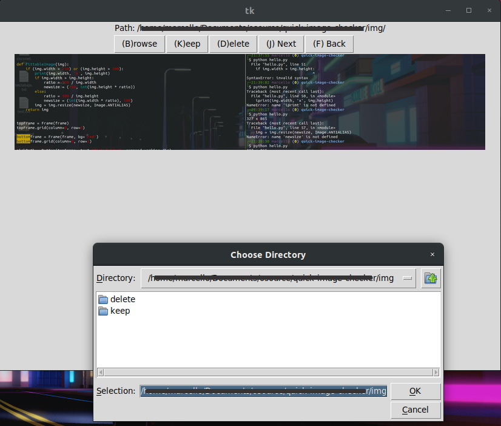

QUIT
===

I QUIT (QUick Image Tagger) to keep cluttered screenshots and Pictures folder. I want to easily and safely view and mark my images for deletion.

---



This project provides a small interface where you can preview your images bigger than thumbnails and move them into a "Keep" or "Delete" folder. This way you can quickly soar through images to review which are valuable and which are not.

This software will move the pictures into another folder but not delete them. If you're sure you want to delete them, you'll have to delete the folder yourself. Maybe an "Apply" functionality could be implemented.

## Usage
You'll run the project (`$ python tagger.py` or by executable) and should select a working path with Browse for the app to scan your folder and check for `jpg`, `png` and `gif` images.

Then you'll press the buttons to Keep or Delete the image which will move (cut and paste) the image into said freshly created folder. If you're not ready to make a choice, simply skip the image with "Next".

#### Shortcuts
| Key | Name   | Description                                    |
|--------|--------|------------------------------------------------|
| `B`    | Browse | Open a directory picker and scan it for images |
| `K`    | Keep   | Move displayed image into `/keep`              |
| `D`    | Delete | Move displayed image into `/delete`            |
| `J`    | Next   | Skip the image and display the next one        |
| `F`    | Back   | Display past image                             |

## Requirements

- `PIL`
- `tkinter`
- `pyinstaller`

## Create executable

Run:
```
$ pyinstaller --onefile tagger.py
```
And your executable will be in:
```
/dist/tagger
```

## TODOS

- [x] Add "Next" and "Previous" buttons for browsing (handle error when going back to classified image)
- [ ] Add previews for 5 next images and 5 previous
- [x] Print in UI the path being worked on.
- [x] Add resposiveness
- [ ] Modify GUI layout: 2 side buttons with "next" and "back". Place "keep" and "delete" buttons below.
- [ ] General refactoring of code (it do be a little disorganized)
